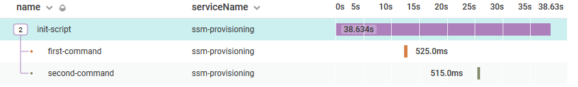
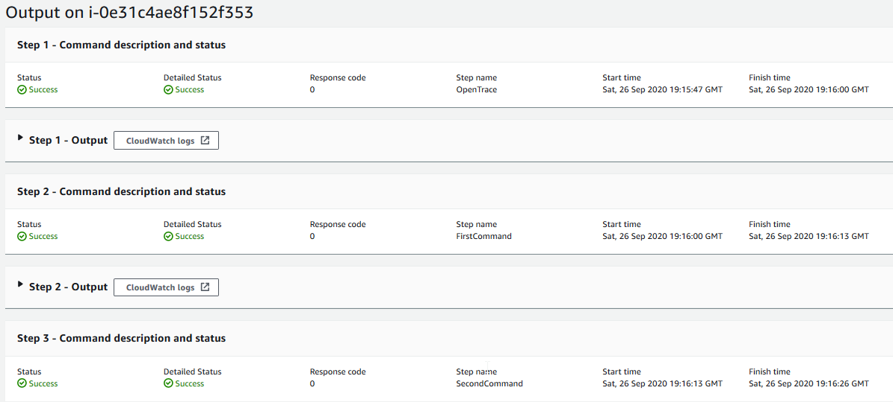

# Overview

This repository contains Terraform resource definitions to re-create our key findings for writing structured logs from SSM run commands and ingesting them into HoneyComb.

Our first finding was a performance delay when when we enabled `CloudWatchOutput` on SSM Run Commands. The second finding was a performance issue with importing `AWSPowerShell` modules that was masked by our default import strategy.

If you're going to run any of the experiments described in this repository, you will need both Terraform v12 and the AWS CLI installed. 

## AWS Infrastructure

There are four Terraform modules to make it easy to create the infrastructure for these experiments. Broadly, we'll create the following infrastructure:

1. CloudWatch and Lambda infrastructure to send structured logs to HoneyComb
1. An EC2 instance to run our experiments against
1. SSM documents to demonstrate provisioning orchestration
1. SSM documents to demonstrate `AWSPowerShell` module performance issues

After creating the infrastructure, you should have outputs available for the `document_name`, `instance_id`, and `cloudwatch_log_group_name`. You will use these values if you perform any of the necessary experiments yourself.

## Performance Delay due to enabling CloudWatchOutput for SSM run commands

In this example, we execute an SSM document, our [orchestrator](./terraform/ssm-orchestration/orchestrator.yml), that invokes two additional SSM documents. Each of these [documents](./terraform/ssm-orchestration/first-run-command.yaml) provides minimal configuration necessary to import the bootstrapped function for structured logging. 

To demonstrate this for yourself, run the following command after you create the infrastructure defined in the previous section:

```sh
aws ssm send-command --document-name $document_name --instance-ids $instanceId \
    --cloud-watch-output-config "{\"CloudWatchOutputEnabled\":$cw_enabled,\"CloudWatchLogGroupName\":\"$cw_log_group_name\"}" \
    --region us-east-1 --query Command.CommandId --output text
```

From HoneyComb we can see a noticeable gap in time between each of the provisioning steps that cannot be accounted for by the execution time of our SSM document.



In the AWS Console, we don't see a delay between each document, but we do see that each document takes significantly longer than we expect.



From your terminal, set `cw_enabled=false` and re-run the same command. If we review the execution output again from the AWS Console, we can observe a more _instantaneous_ flow from one document to the next. Unfortunately, we cannot see this same data in HoneyComb since we don't write any structured logs to CloudWatch 😢. 

Overall, executing the orchestration document _with_ CloudWatch output enabled completes in ~30 seconds while executing the same document _without_ CloudWatch output enabled completes in 4 seconds. The latter performance benchmark is consistent with processing logic defined in each document.

This performance penalty can be ameliorated by a combination of two changes:

1. Modify the `finishItem` function in the [bootstrap script](./terraform/ec2_instance/functions.ps1) to write to a standard file location on the file system
    +   Note: depending on your version of PowerShell you may need to add the following lines to your function:

    ```ps1
    # PowerShell 5.1 does not support a UTF8 encoding without the byte marker. The consequence of this is
    # that when the logs appear in CloudWatch and are processed by the subscription filter (a Lambda), it fails 
    # to correctly convert the string to an object
    if (-not (Test-Path $traceReplayFileName)) {
      $Utf8NoBomEncoding = New-Object System.Text.UTF8Encoding $False
      [System.IO.File]::WriteAllLines($traceReplayFileName, ($compressedJson | Out-String), $Utf8NoBomEncoding)
    } else {
      $compressedJson | Out-File  $traceReplayFileName -Append -Encoding UTF8
    }    
    ```

1. Install the [CloudWatch agent](https://docs.aws.amazon.com/AmazonCloudWatch/latest/monitoring/CloudWatch-Agent-Configuration-File-Details.html#CloudWatch-Agent-Configuration-File-Logssection) on the instance and define the `logs` section to monitor the standard file location used above

## Performance Delay due to `AWSPowerShell` modules

Even after implementing the two fixes from the previous section, there were still mysterious gaps between each span in our trace. We eventually identified that the mysterious gaps were caused by our `AWSPowerShell` import strategy. PowerShell has three different strategies for importing modules into the session, each with slightly different performance characteristics. I'll call these strategies `Lazy`, `Explicit`, and `Requires`. 

The `Lazy` strategy performs module import the first time a function from the module is invoked. Execute the commands below to generate the performance timings for this strategy (note: the `sleep 15s` command ensures that the command has time to execute before we get the invocation details). The module import plus function execution time should take approximately 12 seconds.

```bash
commandId=$(aws ssm send-command --document-name "demo-lazy-import" --instance-ids $instanceId --region us-east-1 --query Command.CommandId --output text)
sleep 15s
aws ssm get-command-invocation --command-id $commandId  --instance-id $instanceId \
  --query '{ExecutionTime:ExecutionElapsedTime,Output:StandardOutputContent}' --output table
```

With the `Explicit` strategy we execute the PowerShell `Import-Module` command directly before invoking the module function. 

```bash
commandId=$(aws ssm send-command --document-name "demo-explicit-import" --instance-ids $instanceId --region us-east-1 --query Command.CommandId --output text)
sleep 15s
aws ssm get-command-invocation --command-id $commandId  --instance-id $instanceId \
  --query '{ExecutionTime:ExecutionElapsedTime,Output:StandardOutputContent}' --output table
```

Now we see module import takes more than 12 seconds to complete and function execution completes in less than 200 milliseconds. In total, these two command timings are consistent with the timings from the `Lazy` import strategy.

Finally, we can observe the unique commands timings for the `Requires` strategy by executing the following set of commands:

```bash
commandId=$(aws ssm send-command --document-name "demo-require-import" --instance-ids $instanceId --region us-east-1 --query Command.CommandId --output text)
sleep 15s
aws ssm get-command-invocation --command-id $commandId  --instance-id $instanceId \
  --query '{ExecutionTime:ExecutionElapsedTime,Output:StandardOutputContent}' --output table
```

Curiously, although the document execution time is more than 12 seconds, the function execution time is less than 200 milliseconds. As we've seen from previous timings, that execution time is consistent with timings when the `AWSPowerShell` module has already been imported into the session. **_What happened to the remaining execution time?_**

The [PowerShell documentation](https://docs.microsoft.com/en-us/powershell/module/microsoft.powershell.core/about/about_requires?view=powershell-7#rules-for-use) for the `Require Module` strategy clarifies that "All `#Requires` statements are always applied globally, **_and must be met, before the script can execute_** (emphasis mine). This is true even when the `#Requires` statement exists in a logically unreachable part of our code, as is the case in our [sample code](./terraform/ssm-powershell/require-module-import.yml):

Regardless of where our provisioning timing shows the import penalty for the `AWSPowershell` module, it's important to note that because each SSM document executes in its own PowerShell document, we incur that penalty each time we import the module.

## Conclusion

Writing structured logs to CloudWatch and then ingesting them into HoneyComb made it significantly easier to spot performance bottlenecks that we could not have otherwise found.

If you created any of the infrastructure to run the experiments, make sure to tear the infrastructure down again (unless you like paying for things you don't use&mdash;seems like there's a metaphor for unstructured logs somewhere in there).

